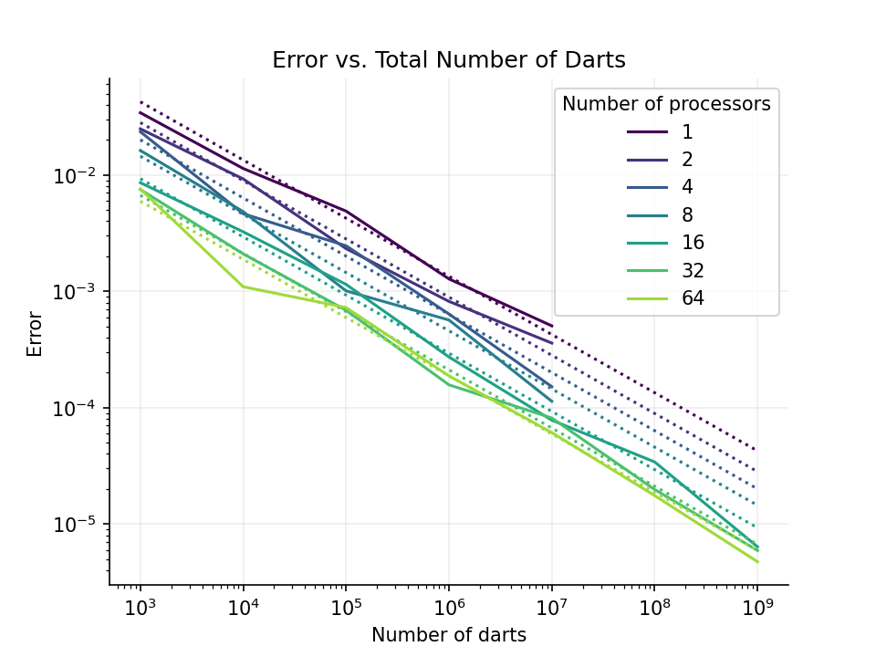

# Project 2: Getting Started with MPI

## Part 1: Warm-up Exercises

As a group, complete the following exercises from [HPSC](../assets/EijkhoutIntroToHPC2020.pdf). 

### Exercise 2.18
Explain the problem with the following code
```c++
// serial initialization
  for (i=0; i<N; i++)
    a[i] = 0.;
  #pragma omp parallel for
  for (i=0; i<N; i++)
    a[i] = b[i] + c[i];
```
The fundamental issue with the code that performs both serial and parallel operations lies in the use of the variable `i`. The variable in both the serial and parallel `for` loops is not properly handled for parallel execution and could lead to a number of problems itemized below.
- **Public Shared Loop Counter Variable:** The variable `i` used in both loops is not declared private in the parallel loop and could be an issue leading to the `race condition` where multiple processes/ processors can also write and modify this `i` variable simultaneously, leading to incorrect indexing and unpredictable results.
- **Sequential Inconsistency in Array Initialization:** In the serial initialization loop, all the element are initialized to zero and because in OpenMP, variables defined outside the parallel region are shared by default, the computation accuracy in parallel loop is further compromised due to the fact of global ordering with respect to local orderings (as explained in example 2.6.1.6. of the textbook).

### Exercise 2.19
Let's say there are $t$ threads, and your code looks like 
```c++
for (i=0; i<N; i++) {
               a[i] = // some calculation
             }
```
If you specify a chunksize of $1$, iterations $0, t, 2t, \ldots$ go to the first thread $1, 1 + t, 1 + 2t, \ldots$ to the second, et cetera. Discuss why this is a bad strategy from a performance point of view. Hint: look up the definition of *false sharing*. What would be a good chunksize?

<span style="color:red">Answer</span>


Because array elements are save consecutively in memory it means that elements like a[0] and a[1] are likely to be on the same page, and will be brough to the same cache line, then if thread 0 modifies a[0], thread 1 modifies a[1], and so on, the same cache line will have to be move multiple times among different cores to keep the changes up to date, reducing the overall performance.


### Exercise 2.21
There is still a problem left with this code: the boundary conditions from the original, global, version have not been taken into account. Give code that solves that problem. 

The code in question is:
```c++
MPI_Comm_rank(MPI_COMM_WORLD,&myTaskID);
       MPI_Comm_size(MPI_COMM_WORLD,&nTasks);
       if (myTaskID==0) leftproc = MPI_PROC_NULL;
         else leftproc = myTaskID-1;
       if (myTaskID==nTasks-1) rightproc = MPI_PROC_NULL;
         else rightproc = myTaskID+1;
       MPI_Sendrecv( &b[LocalProblemSize-1], &bfromleft,  rightproc );
       MPI_Sendrecv( &b[0],                  &bfromright, leftproc);
```
<span style="color:red">Answer</span>

Assuming that the batches are sent in order, in other words, the process with rank 0 handles the elements from 0 to (batch size – 1)


```c++
for (i=0; i<LocalProblemSize; i++) {
    if (i==0) {
        if (rank == 0){
            bleft=0;
        }
        else{
           bleft=bfromleft; 
        }
    }
    else {
        bleft = b[i-1];
    }

    if (i==LocalProblemSize-1) {
        if (rank == last_rank){
            bright=0;
        }
        else{
            bright=bfromright;
        }
    }
    else {
        bright = b[i+1];
    }
    if (rank == 0 || rank == last_rank){
        a[i] = (b[i]+bleft+bright)/2;
    }
    else {
        a[i] = (b[i]+bleft+bright)/3;
    }
}
```

### Exercise 2.22
Take another look at equation (2.5) and give pseudocode that solves the problem using non-blocking sends and receives. What is the disadvantage of this code over a blocking solution? 

The equation is:
$$
\begin{cases}
y_i \longleftarrow y_i+x_{i-1} & i = 1, \ldots, n-1 \\ 
y_0 \longleftarrow y_0+x_{n-1} & i = 0
\end{cases}
$$
<span style="color:red">Answer</span>

```
// serial
for i: 0 to last_rank:
    init buffer i 

// parallel, last rank = n - 1 
buffer my rank = x[my rank]
if my rank ==  last rank:
    send(buffer my rank, 0)
else:
    send(buffer my rank, my rank + 1)

if my rank ==  0:
    x previous = recive(buffer last rank, last rank)
else:
    x previous = recive(buffer my rank - 1, my rank - 1)

y[i] = y[i] + x previous
```

### Exercise 2.23
Analyze the discussion in the last item above. Assume that the bandwidth between the two nodes is only enough to sustain one message at a time. What is the cost savings of the hybrid model over the purely distributed model? Hint: consider width and latency separetly. 

<span style="color:red">Answer</span>

The big issue with the hybrid approach is that it requires handling 2 different issues at the same time, first, the communication between mpi processes, and then the memory management among the ones created by openmp on each mpi process, but assuming it is done correctly is possible to improve the latency among the openmp processes because for most of them, it won’t be necessary to go through the message passing among the network to reach the data that they need, these will simple take advantage of the shared memory of their node, in this way, the bandwidth stays the same but the latency of the system will be improved.

### Exercise 2.27
How much can you gain from the overlapping computation and communication? Hint: consider the border cases where computation takes zero time and there is only communication, and the reverse. Now consider the general case. 

<span style="color:red">Answer</span>

For both border scenarios, we have the same situation, the program will take as much as the amount of communication or computation, depending on the case, that is done by the system, now for the general case it is similar, let's assume that communication takes longer than computation, if these are overlapped the computation time will be irrelevant because it will be done by the time that communication is finished so the overall time that it takes to end the program is the same as the time required for the communication, and if the situation is reversed, so computation takes longer than communication, the overall time will be equal to the time required to compute making the communication time irrelevant

## Part 2: Setup on HPCC 

All of the group members were able to setup the HPCC environemnt for the rest of the work during this project. 

## Part 3: MPI Basics

### 3.1. Question 1-4:

Three printing statements has been added to the HelloWorld code as follows: one before `MPI_Init()`, one after `MPI_Finalize()`, and the last one between the initializing and finalizing the `MPI`. The code is available under `Part2.cpp` and then compiled as `Part2` using the `mpicxx` command. The code was run serial and with `mpiexec`, where the observation is as follows:

#### 3.1.1. Serial run:

In order to run the code in serial, only one process was used with the following command: 

```shell
mpiexec -n 1 Part2
```

the results were as follows:

```
Text before Initializing MPI
Text between MPI structure! Performed on rank#:0
Text After Finalizing MPI
```

This means the only process reads the code and run it line by line. Therefore, all three print statements were printed to the shell.

#### 3.1.2. Run using `mpiexec`

The code was then run using 4 processes through the following command:

```shell
mpiexec -n 4 Part2
```

and the results was as follows:

```
Text before Initializing MPI
Text before Initializing MPI
Text before Initializing MPI
Text before Initializing MPI
Text between MPI structure! Performed on rank#:0
Text between MPI structure! Performed on rank#:2
Text between MPI structure! Performed on rank#:3
Text between MPI structure! Performed on rank#:1
Text After Finalizing MPI
Text After Finalizing MPI
Text After Finalizing MPI
Text After Finalizing MPI
```

As showed, each print statement were printed 4 times. The reason for this observation is that each process runs the print statements before `MPI_Init()` and `MPI_Finalize()` independently. Therefore, 4 print statements of each of them are expected. Also, the printing statement within the `MPI` block was only ran one time by each process. That's why it can be seen that each process (with different rank) printed that statement. In conclusion, because any communication between the processes was NOT defined, it looks like the whole code was run 4 times, but the printed rank numbers showed that different processes were involved.

### 3.2. Exercise 2.3 of Parallel Computing text book:

In this exercise, the name of the process used in the `MPI` block was collected using the `MPI_Get_processor_name` command. Therefore, a C++ code was written to get the name of different processors and print them, which can be found under `ParallelBook_Exercise3.cpp`. The exercise requested to confirm that we are able to run the program on different nodes. For this purpose, a job file was generated and called `Exercise3.sb`, which is later submitted to the HPCC. In this job file, 4 different nodes has been requested where each node has only 1 CPU, as shown below:

```shell
#SBATCH --time=00:10:00
#SBATCH --nodes=4                   # Requesting 4 different nodes.
#SBATCH --ntasks-per-node=1         # Only one task per node.
#SBATCH --cpus-per-task=1           # Only 1 CPU per task, which mean 1 CPU per each node.
#SBATCH --mem-per-cpu=1G            
#SBATCH --job-name Exc2.3
```

After submitting the job file, the name of the processors was found in the `slurm-30833481.out` file, as shown below:

```
skl-144
skl-145
skl-146
skl-143
```

As shown above, three different nodes has been used for running this program, where the names were different. In another word, although we only request one process (i.e. one core) from each node, you can see four different name printed which means the program was run on different nodes, instead of different cores of a single node (or CPU).

### Exercise 2.4 of Parallel Computing text book:

For the first part of this exercise, a program was written in which each process prints a message reporting its number and total number of processes. This code is available at `ParallelBook_Exercise4_part1.cpp`. The code was compiled and run with 4 tasks and the results were as follows:

```
Hello from process 0 out of 4
Hello from process 2 out of 4
Hello from process 3 out of 4
Hello from process 1 out of 4
```

In the next step, it was asked to modify the code so that each process writes its reports into a unique text file. This code is available at `ParallelBook_Exercise4_part2.cpp`. The code was compiled and run with 4 tasks and then 4 different text files were generated `Exercise4_part2_#.txt`, where `#` was associated with the rank of the unique process. 

### Exercise 2.5 of Parallel Computing text book:

For this exercise, the code in exercise 2.4 was modified with an `if` statement based on the `rank == 0`, where the code is available at `ParallelBook_Exercise5.cpp`. As the result, only the message is expected to print from the processor with rank #0. This result has been confirm by running the program with 4 tasks, where the results was as follows:

```
Hello from process 0 out of 4
```

## Part 4: Eat Some Pi 

Pi is the ratio of a circle's circumference to its diameter. As such, the value of pi can be computed as follows. Consider a circle of radius `r` inscribed in a square of side length `r`. Randomly generate points within the square. Determine the number of points in the square that are also in the circle. If `f=nc/ns` is the number of points in the circle divided by the number of points in the square then `pi` can be approximated as `pi ~ 4f`. Note that the more points generated, the better the approximation.

1. Look at the C program `ser_pi_calc`. Extend this program using collective MPI routines to compute `pi` in parallel using the method described above. Feel free to use C++, if you prefer, of course.

2. For the first iteration, perform the same number of "rounds" on each MPI rank. Measure the total runtime using `MPI_WTIME()`. Vary the number of ranks used from 1 to 4. How does the total runtime change?

3. Now, divide the number of "rounds" up amongst the number of ranks using the appropriate MPI routines to decide how to distribute the work. Again, run the program on 1 to 4 ranks. How does the runtime vary now?

4. Now let's change the number of "darts" and ranks. Use your MPI program to compute `pi` using total numbers of "darts" of 1E3, 1E6, and 1E9\. For each dart count, run your code on HPCC with processor counts of 1, 2, 4, 8, 16, 32, and 64\. Keep track of the resulting value of `pi` and the runtimes. Use non-interactive jobs and modify the `submitjob.sb` script as necessary. 

5. For each processor count, plot the resulting errors in your computed values of `pi` compared to the true value as functions of the number of darts used to compute it. Use log-log scaling on this plot. What is the rate of convergence of your algorithm for computing `pi`? Does this value make sense? Does the error or rate of convergence to the correct answer vary with processor count? Should it? 
   
6. For each dart count, make a plot of runtime versus processor count. Each line represents a "strong scaling" study for your code. For each dart count, also plot the "ideal" scaling line. Calculate the parallel scaling efficiency of your code for each dart count. Does the parallel performance vary with dart count? Explain your answer. 

7. Going further. Try running your code on different node types on HPCC with varied core counts. In particular, try to ensure that your runs utilize multiple nodes so that the communication network is used. Do you see a change in the communication cost when the job is run on more than one node?

### Error as a function of darts


#### Discussion
From the plot above we see that increasing the total number of darts (1E3, 1E6, 1E9), increased the accuracy of the approimation of $\pi$ following the law of large numbers. Interestingly, the result revealed that increasing the number of processors, increased the accuracy in the approximation of $\pi$, that is, the analyis using the processor size of 16, 32, and 64, had a higher accuracy compared to 1, 2, 4, and 8. Ideally, increasing the number of processors should decrease computation time but may not linearly improve the accuracy of π. This is because while parallel processing can handle more data points simultaneously, the accuracy is primarily dependent on the total number of darts rather than how quickly they are processed. The observed increase in accuracy with more processors could be due to more efficient computation allowing for a larger number of simulations within a given time, thus adhering better to the law of large numbers for Monte Carlo simulations. 


### Runtime analysis


## What to turn-in

To your git project repo, commit your final working code for the above exercises and a concise write-up including responses to the warm-up exercises, performance and accuracy data for your calculations of `pi`, the plots made in Part 4, and detailed responses to the questions posed concerning your results. 
